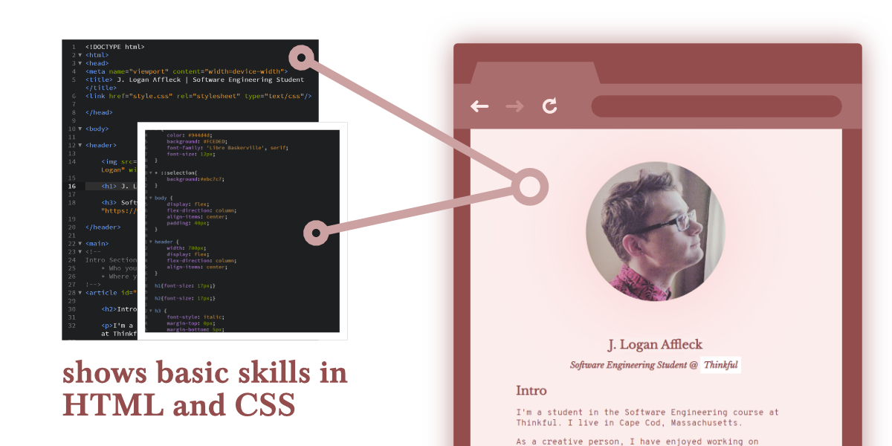

# Portfolio Website Assignment
***

This is the final project for the Thinkful prep course for Software Engineering. It required the use of HTML and CSS to create an example website. [See it here.](https://loganaffleck.github.io/Assignment-Portfolio-Website)



## Content Requirements

1. HTML code that is semantic and valid
2. CSS code that has been written by you, without the use of templates
3. Content that is clear and readable

An Intro section that contains the following information:

* Who you are
* Where you are located

An About Me section that contains the following information:

* A description that shows your passion for web development and your willingness to work with others
* One or two sentences that describe other interests you have outside of web development

A Contact section that contains the following information:
* A link to your LinkedIn profile
* A link to your GitHub profile
* A link to your email (optional)

***

## Technical requirements

* The following HTML Elements:
```
doctype, html, head, body, meta, title,
h1, h2, h3, p, link, ul, ol, img, a, hr
 ```
 
 * The following CSS properties:
 ```
 background, color, font-family, font-size,
 height, margin, padding, text-align
 ```
 
 * Semantic containers like `main`, `article`, and `footer`
 * Styled links using pseudo-classes
 * Comments throughout HTML and CSS
